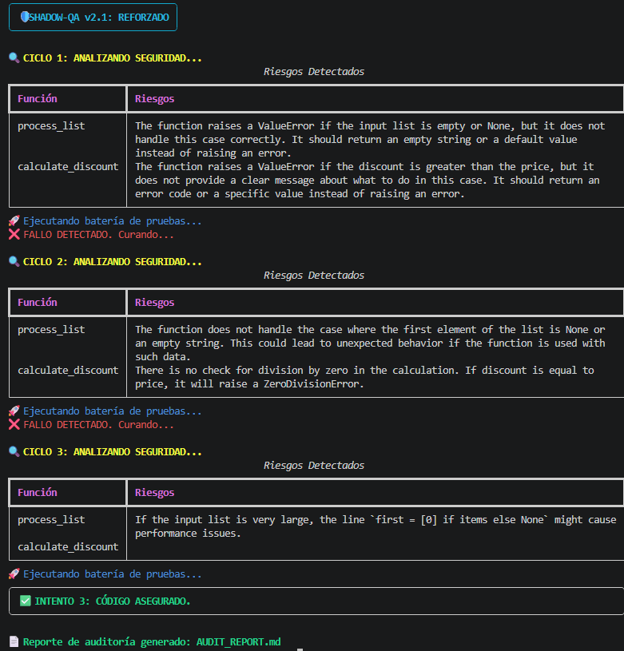

# 🛡️ Shadow-QA v2.1: Autonomous Self-Healing Engineering

**Shadow-QA** no es solo un script de automatización; es un **ecosistema multi-agente** diseñado para llevar la calidad del software al siguiente nivel. Mediante el uso de LLMs (Large Language Models) locales, el sistema es capaz de auditar, atacar y reparar vulnerabilidades de código de forma autónoma, garantizando una robustez técnica superior.

---

## 🚀 La Propuesta de Valor
En un entorno de desarrollo moderno, la velocidad suele comprometer la seguridad. **Shadow-QA** cierra esa brecha mediante tres pilares:

1.  **Auditoría Heurística:** Un agente "Senior Auditor" detecta riesgos lógicos antes de que ocurran.
2.  **QA Adversarial:** Un agente "Hacker" diseña tests de estrés (Edge Cases) con Pytest para intentar romper la lógica.
3.  **Self-Healing (Autocuración):** Un agente "Senior Dev" interpreta los fallos de los tests y reescribe el código hasta que sea indestructible.

---

## 📊 Demostración de Capacidades (Workflow en Vivo)

> [!IMPORTANT]  
> **Mira al sistema en acción:** Aquí se observa cómo Shadow-QA no se conforma con "que funcione", sino que itera hasta alcanzar la excelencia técnica.

### 🧠 ¿Por qué tomó 3 ciclos en el ejemplo anterior?
Un sistema de QA tradicional se detendría si los tests pasan. **Shadow-QA busca robustez, no solo cumplimiento.** * **Ciclos 1 y 2:** El *Analyzer* detectó que, aunque el código ejecutaba, aún existían riesgos latentes (como manejo de tipos o desbordamientos lógicos). El sistema rechazó la versión "funcional" por no ser lo suficientemente "segura".
* **Ciclo 3:** Se logró la armonía total entre el *QA Adversarial* y el *Healer*. El resultado final es un código que no solo pasa los tests, sino que supera todas las expectativas de seguridad y buenas prácticas.

---

## 🛠️ Stack Tecnológico
* **Orquestación:** LangChain (Multi-agent pattern).
* **Cerebro:** Ollama (Llama 3) - *Privacidad total de datos, ejecución local.*
* **Testing:** Pytest.
* **Interfaz:** Rich (CLI Avanzada).
* **Validación:** Pydantic.

---

## 📦 Instalación y Uso

1. **Clonar el repo:**
\`\`\`bash
git clone https://github.com/TU_USUARIO/AI-Shadow-QA.git
cd AI-Shadow-QA
\`\`\`

2. **Instalar dependencias:**
\`\`\`bash
pip install -r requirements.txt
\`\`\`

3. **Configuración local:**
* Asegúrate de tener **Ollama** con el modelo \`llama3\`.
* Crea un archivo \`.env\` (opcional si usas solo Ollama local).

4. **Ejecutar Auditoría:**
\`\`\`bash
python main.py
\`\`\`

---

## 📝 Reportes Profesionales
Al finalizar cada sesión, el sistema genera un **Audit Report** en Markdown, listo para ser revisado por un equipo técnico o stakeholders, detallando cada riesgo mitigado y el estado final del software.

---
**Desarrollado con un enfoque en Ingeniería de Calidad y Automatización de Próxima Generación.**
